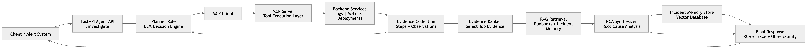
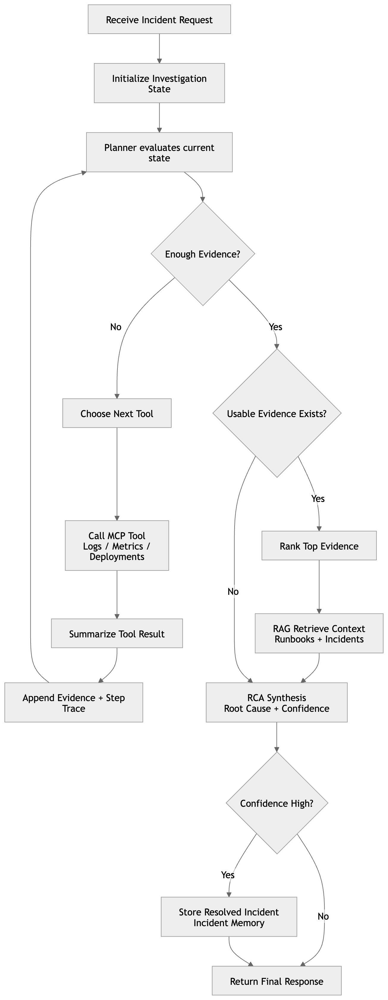
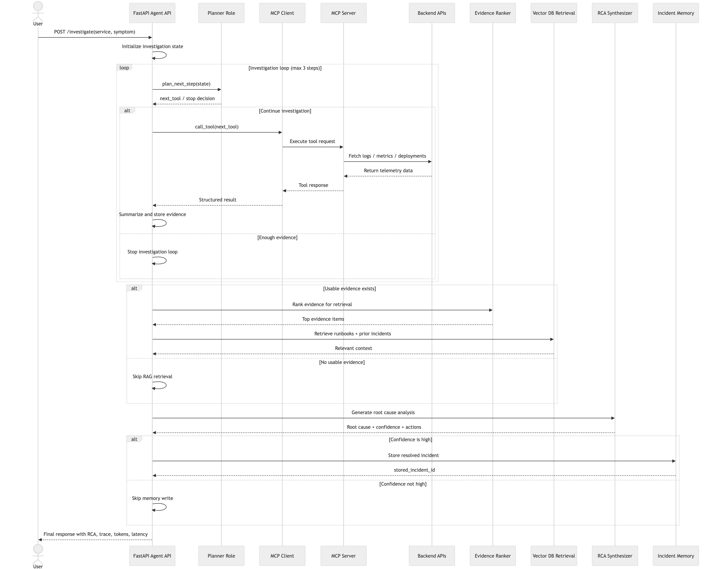

# Incident Analyzer Agent

**Production-style AI-powered incident investigation system using MCP,
RAG, and LLM-based reasoning**

------------------------------------------------------------------------

## Overview

The Incident Analyzer Agent automates incident investigation workflows
in distributed backend systems.\
It collects telemetry data, retrieves relevant historical context,
synthesizes root cause analysis (RCA), and stores resolved incidents for
future learning.

This project demonstrates how **AI can be integrated into real backend
workflows**, not just used as a chatbot.

------------------------------------------------------------------------

## System Model (Important)

This system implements:

-   **1 deterministic workflow**
-   **2 LLM roles**
-   **1 retrieval subsystem**
-   **3 operational tools**

It is **not** a multi-agent system.

``` text
Single Workflow
    ├── Planner (LLM role)
    ├── RCA Synthesizer (LLM role)
    ├── Retrieval (RAG subsystem)
    └── Tool Layer (MCP tools)
```

------------------------------------------------------------------------

## Goal

Build a production-style backend system that:

-   Automates incident investigation
-   Produces structured, explainable diagnoses
-   Learns from historical incidents
-   Demonstrates practical Agentic AI integration
-   Maintains reliability and observability

------------------------------------------------------------------------

## High-Level Flow



``` text
Incident received
      ↓
Planner selects tool
      ↓
Tool returns evidence
      ↓
Planner repeats until enough evidence
      ↓
Retrieve relevant historical context (RAG)
      ↓
RCA synthesizes diagnosis
      ↓
Incident stored if confidence is high
      ↓
Response returned
```
------------------------------------------------------------------------

## Roles in the Workflow



### Planner --- Decision Role (LLM)

Responsible for:

-   Selecting which tool to call
-   Controlling investigation flow
-   Preventing repeated tool execution
-   Determining when enough evidence exists
-   Enforcing execution safety limits

The planner **does not perform diagnosis**.

------------------------------------------------------------------------

### RCA --- Reasoning Role (LLM)

Responsible for:

-   Analyzing collected evidence
-   Using retrieved context
-   Determining root cause
-   Assigning confidence
-   Recommending remediation

The RCA component **does not fetch data or control execution**.

------------------------------------------------------------------------

### Retrieval (RAG) --- Knowledge Subsystem

Responsible for:

-   Searching historical incidents
-   Retrieving runbooks
-   Providing contextual knowledge

Retrieval is a **lookup system**, not a decision engine.

------------------------------------------------------------------------

### MCP Tools --- Data Collection Layer

Implemented tools:

-   get_logs
-   get_metrics
-   get_recent_deployments

Responsible for:

-   Fetching system telemetry
-   Providing diagnostic evidence
-   Returning structured responses

Tools do not make decisions.

------------------------------------------------------------------------

## Technology Stack



### Backend

-   Python
-   FastAPI
-   Async HTTP
-   Structured logging

### AI / Agentic

-   OpenAI API
-   LLM reasoning
-   Prompt-based planning
-   Root Cause Analysis synthesis

### Retrieval

-   ChromaDB
-   Vector search
-   Semantic retrieval

### Integration

-   Model Context Protocol (MCP)

### Observability

-   Token tracking
-   Latency measurement
-   Execution tracing

------------------------------------------------------------------------

## Observability Metrics

The system tracks:

-   planner_calls
-   rca_calls
-   total_llm_calls
-   prompt_tokens
-   completion_tokens
-   total_tokens
-   latency_ms

These metrics enable:

-   performance monitoring
-   cost tracking
-   debugging
-   system optimization

------------------------------------------------------------------------

## Safety Controls

The workflow includes:

-   MAX_STEPS investigation limit
-   Tool failure handling
-   RAG skip when evidence invalid
-   Memory write only on high confidence
-   Duplicate tool prevention
-   Deterministic execution flow

------------------------------------------------------------------------

## Real-World Use Cases

-   Incident response automation
-   SRE workflows
-   Production debugging
-   Reliability engineering
-   DevOps automation
-   Platform monitoring

------------------------------------------------------------------------

## Skills Demonstrated

-   Backend system design
-   Distributed service interaction
-   AI workflow integration
-   Retrieval-Augmented Generation
-   Tool orchestration
-   Observability engineering
-   Production-ready architecture

------------------------------------------------------------------------

## Summary

This project demonstrates how AI can be integrated into backend systems
to automate incident investigation workflows using a structured,
production-style architecture with:

-   deterministic workflow execution
-   decision-driven investigation
-   knowledge retrieval
-   automated root cause analysis
-   incident learning
-   operational observability

------------------------------------------------------------------------

## Sample Run of the project

### Request-1

curl -X 'POST' \
  'http://127.0.0.1:8000/investigate' \
  -H 'accept: application/json' \
  -H 'Content-Type: application/json' \
  -d '{
  "service": "order-service",
  "symptom": "order placement latency spike"
}'

### Response-2

{
  "investigation_id": "082a3b02-24a3-4dd8-8079-5b49504c1c47",
  "service": "order-service",
  "symptom": "order placement latency spike",
  "tools_called": [
    "get_metrics",
    "get_logs"
  ],
  "steps_taken": [
    {
      "step": 1,
      "chosen_tool": "get_metrics",
      "reason": "Latency spike is indicated; checking metrics for detailed capacity, latency, saturation, and error spikes can provide concrete supporting signals.",
      "observation_summary": "Metric evidence: cpu_percent=51.0, memory_percent=51.4, error_rate_percent=6.2, request_rate_rps=169.6, p95_latency_ms=1480.7"
    },
    {
      "step": 2,
      "chosen_tool": "get_logs",
      "reason": "Current metrics show a latency spike and elevated error rate, but need logs to identify concrete error messages or signatures causing the spike.",
      "observation_summary": "Log evidence: INFO Falling back to delayed order confirmation flow | WARN Pending order queue depth increasing | ERROR Timed out waiting for payment authorization"
    },
    {
      "step": 3,
      "chosen_tool": null,
      "reason": "Logs show a direct failure signal: 'ERROR Timed out waiting for payment authorization', and metrics show supporting signals with high latency and increasing queue depth. Two distinct tools have provided useful evidence.",
      "observation_summary": "Investigation complete - enough evidence"
    }
  ],
  "evidence": [
    "Metric evidence: cpu_percent=51.0, memory_percent=51.4, error_rate_percent=6.2, request_rate_rps=169.6, p95_latency_ms=1480.7",
    "Log evidence: INFO Falling back to delayed order confirmation flow | WARN Pending order queue depth increasing | ERROR Timed out waiting for payment authorization"
  ],
  "sources": [
    "mcp:get_metrics",
    "mcp:get_logs",
    "incident:auto_incident_1d946924-4a48-4082-a7c7-79b32437d933",
    "incident:incident_004_order_downstream_payment"
  ],
  "retrieved_context": [
    {
      "type": "incident",
      "source": "incident:auto_incident_1d946924-4a48-4082-a7c7-79b32437d933",
      "content": "Service: order-service\nSymptom: order placement latency spike\nEvidence: Metric evidence: cpu_percent=49.9, memory_percent=55.1, error_rate_percent=9.2, request_rate_rps=170.5, p95_latency_ms=1477.4 | Log evidence: INFO Falling back to delayed order confirmation flow | WARN Pending order queue depth increasing | ERROR Timed out waiting for payment authorization\nRoot cause: Order-service latency spike caused by downstream payment-service slowdown leading to timeouts in payment authorization and queue buildup\nResolution: Generated from automated investigation"
    },
    {
      "type": "incident",
      "source": "incident:incident_004_order_downstream_payment",
      "content": "Service: order-service\nSymptom: order placement latency spike\nEvidence: Timed out waiting for payment authorization | Pending order queue depth increasing | Downstream payment-service latency increased\nRoot cause: Order-service latency driven by downstream payment-service slowdown\nResolution: Investigated payment-service bottleneck | Introduced degraded order confirmation path | Adjusted timeout and queue handling"
    }
  ],
  "enough_evidence": true,
  "rag_evidence_used": [
    "Log evidence: INFO Falling back to delayed order confirmation flow | WARN Pending order queue depth increasing | ERROR Timed out waiting for payment authorization",
    "Metric evidence: cpu_percent=51.0, memory_percent=51.4, error_rate_percent=6.2, request_rate_rps=169.6, p95_latency_ms=1480.7"
  ],
  "likely_root_cause": "Downstream payment-service slowdown causing payment authorization timeouts and pending order queue buildup in order-service",
  "confidence": "high",
  "recommended_actions": [
    "Investigate and resolve performance bottlenecks in payment-service to reduce authorization latency",
    "Implement or improve timeout and retry logic in order-service for payment authorization requests",
    "Monitor and alert on payment authorization latency and order queue depth proactively",
    "Optimize or scale payment-service infrastructure to handle higher load and reduce timeouts",
    "Enhance fallback workflows for delayed order confirmation to minimize impact on user experience"
  ],
  "analysis_summary": "The latency spike and elevated error rate in order-service are strongly correlated with timeouts during payment authorization calls to the downstream payment-service, as evidenced by error logs and increased pending order queue depth. Metrics confirm system resources are not saturated, pointing to an external dependency slowdown. Similar prior incidents also attribute root cause to payment-service delays. Thus, payment-service performance issues lead to cascading latency and error accumulation within order-service.",
  "stored_incident_id": "auto_incident_55675af0-c5b9-4d85-b4cc-285120fe54d2",
  "llm_observability": {
    "planner_calls": 3,
    "rca_calls": 1,
    "total_llm_calls": 4,
    "prompt_tokens": 1746,
    "completion_tokens": 380,
    "total_tokens": 2126
  },
  "latency_ms": 5993
}

### Request-1

curl -X 'POST' \
  'http://127.0.0.1:8000/investigate' \
  -H 'accept: application/json' \
  -H 'Content-Type: application/json' \
  -d '{
  "service": "inventory-service", 
  "symptom": "intermittent order failures"
}'

### Response-2

{
  "investigation_id": "66c8ff84-5d5c-4f9d-99ae-76549a28d5e3",
  "service": "inventory-service",
  "symptom": "intermittent order failures",
  "tools_called": [
    "get_logs",
    "get_metrics",
    "get_recent_deployments"
  ],
  "steps_taken": [
    {
      "step": 1,
      "chosen_tool": "get_logs",
      "reason": "Logs may reveal direct error messages or signatures causing the intermittent order failures in the inventory-service.",
      "observation_summary": "get_logs returned no data (MCP call failed)"
    },
    {
      "step": 2,
      "chosen_tool": "get_metrics",
      "reason": "Logs are unavailable or failed (MCP call failed), so checking metrics for capacity, latency, saturation, or error spikes can provide supporting evidence of the failure cause.",
      "observation_summary": "get_metrics returned no data (MCP call failed)"
    },
    {
      "step": 3,
      "chosen_tool": "get_recent_deployments",
      "reason": "Logs and metrics calls failed to provide data, so checking recent deployments may reveal if a release caused regressions linked to the intermittent order failures.",
      "observation_summary": "get_recent_deployments returned no data (MCP call failed)"
    }
  ],
  "evidence": [
    "get_logs returned no data (MCP call failed)",
    "get_metrics returned no data (MCP call failed)",
    "get_recent_deployments returned no data (MCP call failed)"
  ],
  "sources": [
    "mcp:get_logs",
    "mcp:get_metrics",
    "mcp:get_recent_deployments"
  ],
  "retrieved_context": [],
  "enough_evidence": false,
  "rag_evidence_used": [],
  "likely_root_cause": "MCP (Monitoring Control Plane) service failure causing inability to retrieve logs, metrics, and deployment data for the inventory-service",
  "confidence": "high",
  "recommended_actions": [
    "Investigate and resolve the MCP service outage or connectivity issues preventing data retrieval",
    "Implement alerting for MCP service health to detect future failures earlier",
    "Establish fallback logging or local storage to capture service telemetry during MCP outages",
    "Perform a manual health check on the inventory-service to determine if the service itself is experiencing failures",
    "Once MCP is restored, review logs and metrics for the time window correlating with intermittent order failures"
  ],
  "analysis_summary": "The investigation was unable to retrieve logs, metrics, or deployment data due to MCP call failures, indicating a systemic monitoring/control plane issue rather than an isolated service failure. The root cause of intermittent order failures in inventory-service cannot be directly identified without this data, pointing to the need to restore MCP functionality before further diagnosis can proceed.",
  "stored_incident_id": null,
  "llm_observability": {
    "planner_calls": 3,
    "rca_calls": 1,
    "total_llm_calls": 4,
    "prompt_tokens": 1321,
    "completion_tokens": 374,
    "total_tokens": 1695
  },
  "latency_ms": 4621
}
